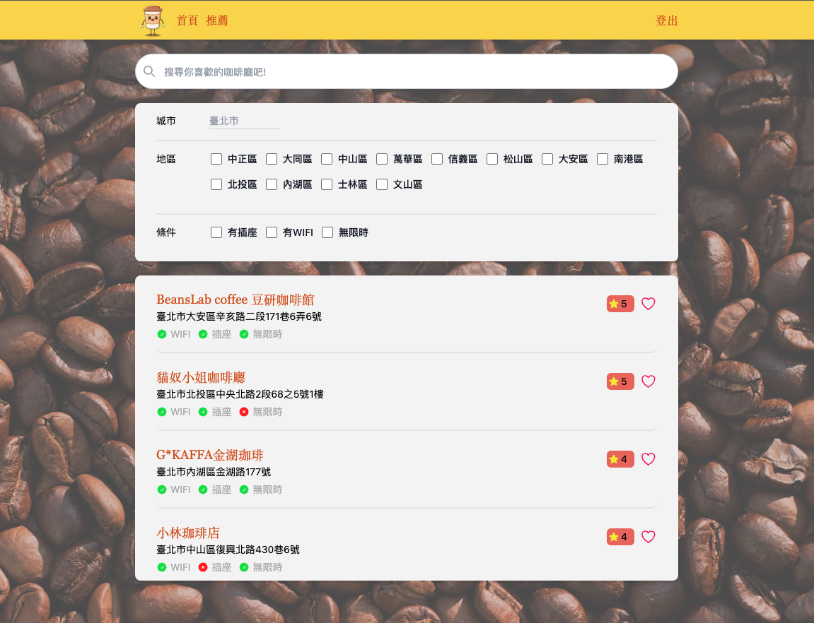
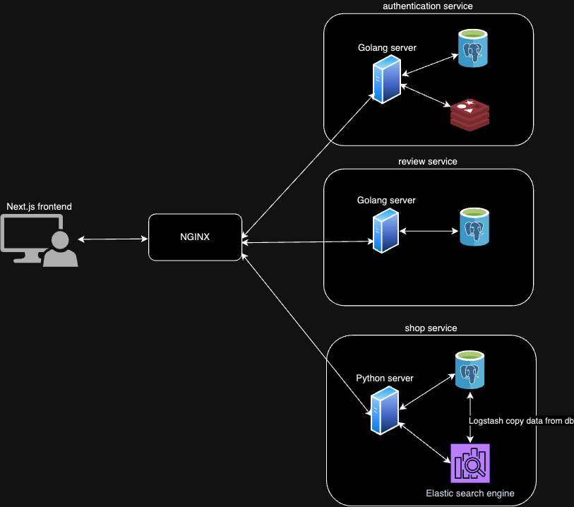

# coffee shop finder
The Coffee Shop Finder app is a full-stack project designed to help users find their preferred coffee shops. The frontend is built with Next.js, while the backend leverages Python, Golang, and Elasticsearch in microservices system structure. 

&emsp;
 
&emsp;

## System structure

 

## Tech stack

| name                | remark                |
| ------------------ | ------------------- |
|Next.js             |frontend framework              |
|Python + Fastapi     |shop information service        |
|Golang              |auth and review service             |
|Elasticsearch        |coffeeshop search engine         |
|postgresql            |             |
|redis                |             |